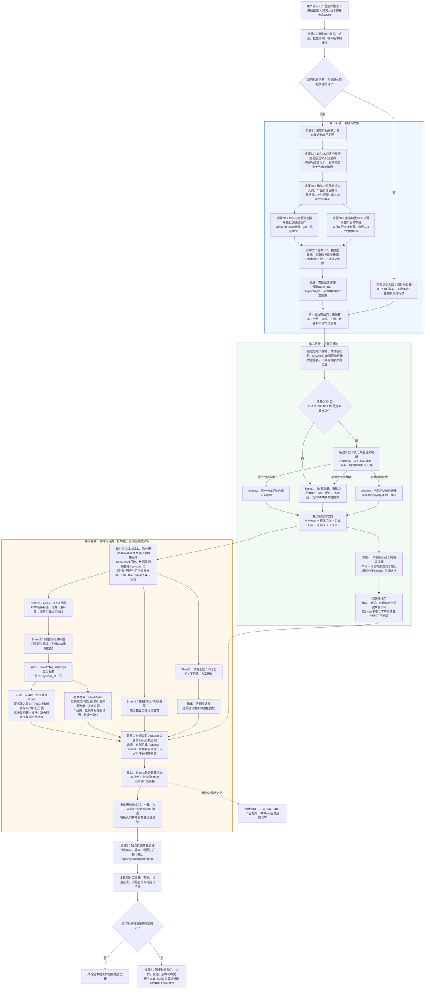
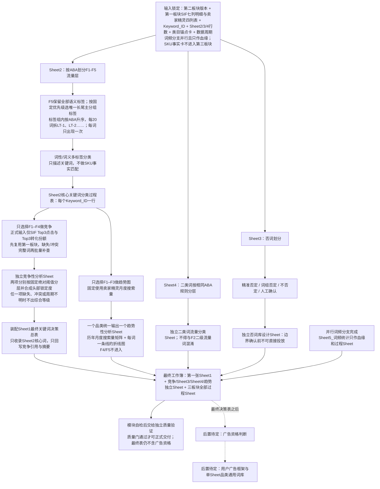
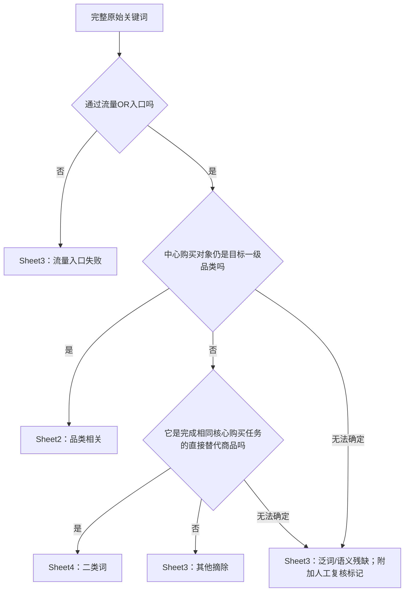

# Amazon 关键词库：从用户输入到本机输出

- Status: active human guide
- Baseline: V2.1
- Last synchronized: 2026-08-21
- Sharing: sanitized
- Owner: Amazon 关键词知识库项目主任务
- Synchronization note: 已同步2026-08-21首轮真实运行后的减配：SIF竞品反查完整接口响应只留本机，副任务装配七列最小明细和核心词候选摘要；卖家精灵关键词挖掘固定只请求四个业务字段，副任务完成四列表格后以路径、哈希和数量回传；主任务以工作簿哈希加行号生成确定性回传行ID，内部原始事件血缘继续留副任务清单；竞争性仅使用SIF Top3点击份额与Top3转化份额，优先复用第一板块证据，缺失时按完整词批量补查，不再使用机会筛选、竞争格局、CPC、SPR、商品数量、市场CVR、入场信号、比较池或样本门。趋势规则本轮已复核、暂不调整。十二个Skills继续为draft/planned，本次减配和P0复核不产生P1证据，V2.1/V2.2基线不变

这是一份给人看的项目说明书。读完前三部分，应当能够回答：用户要提供什么、项目怎样一步步运行、每一步如何判定、最终会在本机得到什么，以及项目当前做到哪里。

> 本文负责解释，不单独制定业务规则。精确规则仍由知识、判定边界和对应 Skill 拥有；文末列出负责文件。

阅读导航：

- 想知道项目怎么运行：读第一部分。
- 想查核心大词、细分品类词、二类词和 Sheet2/3/4 怎么判：读第二部分。
- 想知道已经做完什么、下一步是什么：直接读第三部分。

---

# 第一部分：项目流程

## 1. 一眼看懂完整流程

三个板块的交接关系：

| 板块 | 必要输入 | 主要输出 | 完成门与当前成熟度 |
|---|---|---|---|
| 第一板块：关键词收集 | 产品事实、自有品牌/别名、基础配置、直接竞品 ASIN、站点和授权 | 三类来源明细、类目锚点卡、SKU事实卡、规范流量、稳定主键和十表原始工作簿 | 联想为必选；三个来源Skill和主任务合并合同均为`draft/planned`，当前首轮因内置浏览器不可操作而`not_executed` |
| 第二板块：关键词清洗与词频 | 第一板块工作簿、类目锚点卡、锁定行数 | Sheet2 品类相关、Sheet3 其他摘除、Sheet4 二类词，以及只读 Sheet2 派生的 `Sheet5_词频统计` | 三表唯一去向且行数闭环；词频单词/双词数量闭环且原 Sheet 不变；清洗与词频 Skills 均为 `draft` |
| 第三板块：分类与分析 | 第二板块版本、第一板块SIF七列明细与卖家精灵四列表、Sheet2/3/4、周期和主键；不输入SKU事实卡；Sheet5词频可并行产生 | F5唯一主标签分类、Top3-only独立竞争Sheet、二类词/否词候选和卖家精灵F1–F3月度趋势Sheet | Top3任一项缺失不出竞争等级；月份为空不出趋势；新规则未重跑，Skills无P1 |
| 最终工作簿装配 | 三个板块全部实际 Sheet、稳定主键、版本和 Sheet 清单 | 第一张 Sheet2-only 最终关键词决策总表；词频、竞争、Sheet3、Sheet4、趋势独立；全部过程 Sheet 保留 | 装配 draft Skill 已更新；缺少应有词频 Sheet 时回到词频 Skill，不在装配阶段重算；分类与否词边界未完成时只能装配已确认输入 |
| 独立质量验证 | 锁定的Run、输入版本、各阶段合同、工作簿与渲染/检查记录 | 质量报告、问题台账、`pass/blocked/incomplete`门状态 | 只读核验，不访问业务外部系统、不修复上游、不新增业务判断；draft Skill 无P1 |

当前唯一可执行知识基线仍是 V2.1。广告资格不在前三个板块内提前判断，只能后置到最终关键词决策总表之后；广告框架和单 Sheet 品类通用词库继续待定。

## 2. 本项目使用哪些 MCP 和本机能力

公司原版第一板块明确使用三类关键词来源：**SIF MCP 竞品 ASIN 流量词反查、Amazon 搜索框联想、卖家精灵 MCP 关键词挖掘**。其中只有 SIF 和卖家精灵属于 MCP；Amazon 搜索框依赖浏览器，工作簿生成与验证依赖本机表格能力。

本轮来源范围只包含这三类。没有新的用户确认时，不增加第四类来源，也不使用广告报告、其他关键词平台或模型自行生成词来补数量。

| 环节 | 公司原版工具或能力 | 项目能力 ID | 主要输入 | 主要输出 | 当前状态 |
|---|---|---|---|---|---|
| 竞品流量反查 | SIF MCP | `keyword.source.competitor-traffic.query` | 站点、逐个获准竞品 ASIN、最近 30 天 | 完整响应本机指针、七列最小明细、核心词候选和覆盖状态 | 本机已由用户确认连接；接口无字段选择，完整响应只留副任务本机证据 |
| 搜索框联想 | Codex 内置浏览器；不是 MCP | `keyword.source.autocomplete.capture` | 主锚点、Amazon US未登录、All、邮编10001 | 固定矩阵可见联想词、触发输入、环境和执行状态 | 必选来源；当前浏览器可打开但不能识别/操作，首轮为`not_executed` |
| 大范围扩词 | 卖家精灵 MCP | `keyword.source.keyword-mining.query` | 站点、1–3 个代表种子、页码、`returnFields=keyword,keywordCn,searchRank,searches` | 英文关键词、中文翻译、ABA月排名、月搜索量及副任务四列表 | 本机已由用户确认连接；至少两Pass，第二Pass有新增/换位时最多第三Pass |
| 三来源机械合并与十表装配 | 主任务operations合同和本机表格能力；不是 MCP | `keyword.source.merge-and-assemble` | 三个来源子任务的锁定交付、类目锚点卡和 SKU 事实卡 | 十表工作簿、跨表主键、公式扫描、渲染复核 | `planned`；只做机械合并，不交给任一来源Skill |
| 品类清洗 | 完整词语义判断和本机表格处理；不调用 SIF 或卖家精灵 | `keyword.library.clean` | 原始词池、流量字段和类目锚点卡 | Sheet2、Sheet3、Sheet4、附加复核标记和质检 | `planned`；四个历史案例不等于新 Skill P1 |
| Sheet2 词频统计 | 本机 Spreadsheets/工作簿能力；不调用外部业务系统 | `keyword.library.word-frequency` | 已闭环的 Sheet2 完整关键词列 | 单词与相邻有序双词排序、数量闭环、`Sheet5_词频统计` | `planned`；V2.2 业务规则已确认，迁入前试算不等于 P1 |
| 竞争Top3缺失补查 | SIF MCP | `keyword.competition.sif-top3.query` | 站点、F1–F4完整关键词，每批最多10词，周粒度 | 最新日期、Top3点击份额、Top3转化份额 | `planned`；先复用第一板块，只有缺失/冲突词才补查 |
| 卖家精灵精确词月度趋势 | 卖家精灵 MCP | `keyword.trend.sellersprite-aba.query` | 站点、F1–F3单个关键词和月度粒度 | 精确词历年月度搜索量和可用年月 | `planned`；趋势图唯一正式来源，不重跑挖掘，失败时不回退 SIF |
| 竞争输出写入与模块自检 | 本机表格能力 | `keyword.competition.outputs.write-and-verify` | Sheet2 F1–F4竞争证据和来源周期 | 一个独立竞争Sheet、竞争摘要字段和模块检查记录 | `planned`；不读取SKU事实卡、不生成趋势图 |
| 趋势输出写入与模块自检 | 本机表格能力 | `keyword.trend.output.write-and-verify` | F1–F3卖家精灵月度搜索量和来源周期 | 一张品类F1–F3历年月度搜索量折线图及模块检查记录 | `planned`；不输出竞争等级或趋势标签 |
| 最终工作簿装配 | 本机表格能力 | `keyword.workbook.final.assemble` | 三个板块工作簿、Sheet清单和稳定主键 | Sheet1核心词总表、独立竞争/二类词/否词/趋势Sheet和所有过程Sheet | `planned`；不改变上游业务判断 |
| Sheet清单质检 | 本机表格能力 | `keyword.workbook.sheet-manifest.verify` | 最终工作簿和阶段Sheet清单 | 过程Sheet完整性、表名映射、主键和行数检查 | `planned`；缺失时阻断交付 |
| 独立质量验证 | 本机只读文件、表格和渲染能力 | `keyword.quality.validate` | 锁定Run、版本、合同、工作簿、渲染与检查记录 | 独立质量报告、问题台账和`pass/blocked/incomplete` | `planned`；不访问业务外部系统、不修复上游 |
| 知识更新 | 本机仓库文件和验证能力；不是外部 MCP | `keyword.library.publish` | 已审查、脱敏的候选结论 | 知识、索引、版本、交接和本文 | `planned`；需要项目写入授权 |

### 当前仍未完成或受限制的能力

| 板块 | 当前状态 | Skill 与限制 |
|---|---|---|
| 词频分析 | V2.2 组件规则与 draft Skill 已迁入 | 只读 Sheet2，机械统计单词和相邻有序双词；能力仍为 `planned`，尚无两个正常案例和一个边界/异常案例 |
| 关键词分类 | Sheet2/3/4分类结构和输出合同已更新 | F1–F5、多标签、F5唯一主标签与标签内LT、Sheet4流量分类和Sheet3候选；否词方式待验证；尚无P1 |
| 竞争性分析 | F1–F4独立竞争、Top3-only正式值和固定绝对阈值已确认，独立draft Skill已同步 | 不使用比较池或样本门；Top3任一项缺失、冲突或周期不明时不出综合等级；新规则未重跑且Skill无P1 |
| 趋势性分析 | 卖家精灵F1–F3折线图与月份门已确认，已拆为独立draft Skill | 趋势月份为空不生成图；Skill无P1 |
| 最终工作簿 | Sheet1人口、独立输出和全过程Sheet保留合同已确认，draft Skill 已建立 | 应有词频 Sheet 缺失时阻断完整装配；分类与否词判断未完成时不能声称最终工作簿已完成 |
| 独立质量验证 | 只读质量合同和draft Skill已建立，P0结构校验通过 | 尚无两个正常案例和一个边界/异常案例；不得冒充P1或verified |
| 广告资格和下游输出 | 明确后置到最终关键词决策总表之后 | 广告框架和单 Sheet 品类通用词库规则待用户后续确认，不属于当前第三板块第一、二部分 |

本项目目前有十个业务 Skill：SIF竞品反查、Amazon联想、卖家精灵扩词、品类清洗、词频、关键词分类、竞争分析、趋势分析、最终工作簿装配、独立质量验证；另有版本协调、知识发布两个项目维护 Skill。没有广告资格 Skill。十二个 Skill 均为 `draft`，不代表 P1 已通过。

### 本机可用和 Skill 成熟度是两件事

- **本机可用性：** 用户已确认当前电脑的 SIF MCP 和卖家精灵 MCP 均已连接；内置浏览器可以拉起但当前不能识别/操作 Amazon 页面，该技术项暂缓。
- **Skill 成熟度：** 能力清单中的 `planned` 只表示新拆分的 Skill 尚未形成规定数量的可迁移执行证据，不表示本机 MCP 未连接。
- 仓库不保存 MCP 地址、方法凭据、Cookie、Token 或账号授权。实际业务执行时直接使用本机已连接能力；如果工具自己返回字段或分页结构变化，按异常规则处理。
- 如果未来换到另一台电脑且对应 MCP 确实不可用，该来源标记 `not executed`，整批采集保持未完成；不能静默换成其他来源。
- 公司原版 V2.1 的固定执行参数是 SIF 每个 ASIN 取接口上限 300 条、卖家精灵每页 20 条；当前卖家精灵固定请求四个业务字段并执行至少两个、最多三个收敛Pass。实际返回结构若冲突，记录异常并保持已取得数据，不静默把新数值写成业务规则。

### MCP 发生异常时

- SIF 查不到数据：检查站点、父子体和 ASIN 状态；记录失败，不用未经用户确认的相似 ASIN 替换。
- 卖家精灵 MCP 明确报错、限流、返回结构异常、缺页、整页重复、循环页或四字段结构性缺失：停止受影响Pass，保留已取得数据并继续其他锁定种子；单行指标空白只记录字段缺失。只有全部种子达到Pass门时才能标记`complete_with_residual_risk`。
- MCP 调用成功但返回零结果：先检查方法名、站点和必填参数，修正后重新拉取；未取得正常结果前不能标记完成。
- 适配器达到自身上限只能称为“接口范围内已完整”，不能称为“Amazon 全量关键词”。

## 3. 用户输入规范

### 3.1 公司原版确认的三类业务输入

| 业务输入 | 用户需要提供什么 | 用在哪里 |
|---|---|---|
| 产品基础信息 | 产品名称与类型、实际出售的完整商品中心、自有品牌名与别名（没有则写无）、外观/结构/定位、主要用途和使用方式 | 确认产品身份、品牌路由和一级品类 |
| 产品基础配置 | 尺寸、材质、结构、数量、承重、功率、接口、兼容对象、具备/不具备功能和父子体差异 | 建立 SKU 事实卡和细分品类词 |
| 直接对标竞品 ASIN | 通常 3–5 个直接竞品；父 ASIN、错误站点或无数据 ASIN要记录并补充可查询子体 | SIF MCP 反查和核心大词候选 |

公司原版不要求用户另外准备 ABA 表、搜索框联想结果、广告报告或类目报告；这些数据由第一板块在获准工具范围内产生。站点是工具执行参数，由当前任务环境或 ASIN 所属站点确认，不作为第四类业务输入。

### 3.2 Codex 仍需确认的任务设置

| 任务设置 | 需要确认什么 |
|---|---|
| 本次唯一目标 | 采集、清洗、分类规则、竞争性规则、趋势性规则、知识更新或版本验收，只选一个主目标；广告资格与广告框架另行立项 |
| 站点与语言 | 根据任务环境或 ASIN 确认目标站点和主要语言 |
| 数据与工具授权 | 可以读取哪些文件、浏览器会话或 MCP；是否允许写入项目仓库 |
| 时间口径 | 实际查询日期和报告周期；SIF 当前采用最近 30 天 |
| 期望输出 | 本机工作簿、待确认清单、质检摘要，以及是否更新项目知识 |

缺少数据授权、产品基础信息或一级品类无法确认时，不能直接开始采集或清洗。

### 3.3 根据起点补充输入

#### 从零开始建立关键词池

还需要：经确认的直接竞品范围、获准的竞品流量来源、Amazon 搜索框环境和关键词挖掘来源。

#### 已有原始词池，直接开始清洗

还需要：可读取的原始工作簿、原始关键词或稳定 `Keyword_ID`、来源字段、ABA 排名、月搜索量、类目锚点卡、SKU 事实卡和原始行数。

#### 已有第二板块结果，进入第三板块

还需要：锁定的第二板块工作簿版本、第一板块 `04_SIF原始数据`七列明细和`06_卖家精灵原始数据`四列表版本、Sheet2/3/4 原始行数、稳定 `Keyword_ID`、类目锚点卡、站点和数据周期。SKU 事实卡不进入第三板块；`Sheet5_词频统计`可与分类并行产生，只作为血缘和最终过程 Sheet 保留，不参与第三板块判断。最终装配前缺少应有词频结果时回到词频 Skill 补齐。

#### 只更新知识库或 Skill

还需要：已复核结论、来源、适用范围、用户确认状态和变更目标；同时必须同步更新本文。

### 3.4 不写入 Git 的本机材料

原始聊天、原始广告导出、原始或结果 XLSX、截图、运行日志、内部网址、真实联系信息、账号数据、凭据和源电脑绝对路径可以在获准范围内用于本机工作，但不进入项目仓库。

## 4. 每一步怎样执行

本章按真实数据流分成三个大板块，不再把所有步骤平铺在同一层级。关键词先在第一板块被抓取并保留原始证据，再在第二板块完成 Sheet2/3/4 唯一分流，最后才进入第三板块的流量分层、词义标签、竞争/趋势分析和最终工作簿装配。

| 大板块 | 对应步骤 | 直接输入 | 关键处理 | 交给下一板块的结果 |
|---|---|---|---|---|
| 第一板块：关键词抓取 | 步骤 1–2 | 产品事实、竞品 ASIN、站点和工具授权 | SIF 竞品流量词、Amazon 搜索框联想、卖家精灵逐页扩词；只做机械匹配 | 十表原始工作簿、类目锚点卡、SKU 事实卡、稳定 `Keyword_ID` |
| 第二板块：关键词清洗与词频 | 步骤 3–4 | 第一板块原始词池、类目锚点卡、锁定行数 | 流量 OR 门、完整词语义判断、Sheet2/3/4 唯一去向、行数闭环；只读 Sheet2 统计单词和相邻有序双词 | Sheet2 品类相关词、Sheet3 其他摘除词、Sheet4 二类词、`Sheet5_词频统计` |
| 第三板块：分类与竞争/趋势 | 步骤 5 | 第二板块 Sheet2/3/4、第一板块SIF七列明细、卖家精灵四列表和稳定主键；词频分支并行 | ABA F1–F5、词性/词义标签、否词候选、Top3-only F1–F4独立竞争 Sheet、品类 F1–F3 历年月度搜索量折线图；不使用词频做判断 | Sheet1 最终决策总表、词频/竞争/Sheet3/Sheet4/趋势独立 Sheet、全部过程 Sheet |

步骤 0 是全流程前置门，步骤 6–7 是三个板块共用的独立质量验证、交付和知识更新，不单独算第四板块。

### 执行前：步骤 0 确认本次任务

**需要：** 用户输入规范中的资料和当前项目版本。

**怎样做：**

1. 确认当前基线为 V2.1。
2. 把任务限制为SIF竞品反查、Amazon联想、卖家精灵扩词、三来源机械合并、清洗、分类规则、竞争性规则、趋势性规则、质量验证、发布或版本管理中的一个主目标。
3. 写清输入、排除项、允许动作、风险、验收和回传格式。
4. 三个来源分别路由给对应采集Skill，三来源机械合并与十表装配由主任务operations合同负责；清洗、竞争、趋势、最终装配、独立质量验证或发布分别路由给对应Skill。分类只有流程结构、没有完整判定边界时只形成规则设计和待确认问题。竞争按已确认边界执行但仍需P1；趋势图只输出卖家精灵F1–F3历年月度搜索量，卖家精灵趋势数据不可用时停止。

**输出：** 一份边界清楚的任务说明。

**停止条件：** 来源授权、公司政策、所有权或目标范围不明确。

### 第一板块：关键词抓取

这一板块只负责把原始关键词尽可能完整、可追溯地抓回来。它可以建立类目锚点和 SKU 事实，但不做品类清洗、ABA 流量分类、词义标签、竞争性或广告资格判断。

#### 步骤 1：整理产品事实和竞品范围

**需要：** 产品基础信息、产品基础配置、自有品牌名及已知别名，以及通常 3–5 个直接对标竞品 ASIN。

**怎样做：**

1. 明确实际出售的完整商品中心、主要用途和使用方式。
2. 整理结构、材质、尺寸、数量、承重、接口、兼容对象，以及具备、不具备和待核实的功能。
3. 有变体时分开记录父体共享事实和子体专属事实。
4. 检查竞品 ASIN 的站点、格式、父子体和是否为真正直接竞品。
5. 单独记录自有品牌名和已知别名，供第二板块区分自有品牌目标商品词与第三方品牌/IP词；不把品牌事实变成通用清洗词典。
6. 此时不凭产品名称猜一级品类核心大词；一级品类候选必须等 SIF 真实流量证据返回后确认。

**输出：** 待填充的类目锚点卡、SKU 事实卡、自有品牌记录、竞品 ASIN 范围表。

**停止条件：** 产品中心或关键配置不清楚；竞品不是直接对标对象；父 ASIN 无数据却没有可查询子体。

#### 步骤 2：采集原始关键词

负责来源 Skills：[amazon-keyword-sif-competitor-collection](../.agents/skills/amazon-keyword-sif-competitor-collection/SKILL.md)、[amazon-keyword-amazon-autocomplete](../.agents/skills/amazon-keyword-amazon-autocomplete/SKILL.md)、[amazon-keyword-sellersprite-expansion](../.agents/skills/amazon-keyword-sellersprite-expansion/SKILL.md)

负责机械合并与十表装配：[amazon-keyword-library-operations](../.agents/skills/amazon-keyword-library-operations/SKILL.md)及其[来源合并合同](../.agents/skills/amazon-keyword-library-operations/references/source-merge-contract.md)

**需要：** 步骤 1 的三类输入、目标站点，以及本机已经连接的 SIF MCP、浏览器和卖家精灵 MCP。

**怎样做：**

**2A. 用 SIF MCP 逐个反查直接竞品**

1. SIF 是第一个实质采集步骤，一次只查询一个已确认竞品 ASIN。调用前先建立被 Git 忽略的批次目录，目录不存在时不得先发起调用。
2. 每次响应返回后立即把完整原始响应写入该批次目录，再做任何解析或汇总；保存 ASIN、站点、全部入参、调用时间、数据截止日期、返回行数和批次号。
3. 时间统一为最近 30 天，不另外叠加最近 7 天。若接口只返回数据截止日期而不返回开始日期，周期写`最近30天`、开始日期写`接口未返回`，不得反推日期。
4. 返回数量设置为公司版 V2.1 已确认的当前接口上限：每个 ASIN 300 条。取满 300 条只代表取满接口范围，不代表 Amazon 全部关键词。
5. SIF接口当前不支持选择返回字段；每个ASIN的完整响应只保存在副任务本机忽略目录，不把响应正文传入主任务上下文。副任务另行装配七列最小明细：竞品ASIN、SIF返回序号、英文关键词、ABA排名、搜索量、Top3点击份额、Top3转化份额。
6. 每个竞品返回记录在七列明细中保留一行，不因低流量、重复或看起来无关而删除；副任务可按机械键生成核心词候选摘要，但不直接确认最终锚点。重试或补拉必须形成新版本调用，不覆盖旧响应。
7. SIF 同时承担两件事：提供正式原始关键词来源；用真实流量表达提出一级品类核心大词候选和后续竞争所需Top3证据。它不负责穷尽所有关键词，也不负责确认 SKU 精准细分类型。

主任务至少能够从工作簿看回七列明细，并从清单看回查询参数、查询周期、抓取时间、逐竞品行数、完整响应本机指针、哈希、字段缺失/冲突和完成状态。接口返回的其他字段只在本机完整响应中保留，不复制进主任务消息或业务工作簿。

**2B. 确认两层产品词和 1–3 个代表种子**

1. 用竞品 SIF 流量词发现一级品类核心大词候选。
2. 用产品基础信息确认目标产品确实属于该一级品类。
3. 用基础配置确认目标 SKU 的产品细分品类词；不确定时标记`待核实`。
4. 候选同时出现在至少两个竞品中是优先证据，但不是硬门槛。
5. 流量优先比较 ABA 排名；ABA 缺失或不可比时再看月搜索量，两者不合成一个分数。
6. 最终选择唯一主一级品类核心大词，并保留 1–3 个具有不同扩词方向的代表种子。同一词根、扩词方向高度重合的近义或词性变体只执行一个代表词；带卖点、颜色、尺寸、配置、功能、人群或场景修饰的长表达不能作为扩词种子。

本步骤正式产出两张不同用途的卡：

- **类目锚点卡：** 一级商品品类、主一级品类核心大词、主流同义表达、已确认细分类型、品类包含/排除边界、产品/配件边界和语义歧义。
- **SKU 事实卡：** 目标 SKU 精准细分品类、结构、尺寸/承重/容量、材质、组件、功能、人群场景、具备/不具备项、禁止宣称项和直接竞品细分类型。

主任务完成本步骤后，同时下发2C Amazon联想和2D卖家精灵扩词；两个分支并行执行、各自保留版本与完成状态。2E三来源机械合并必须等待SIF、联想和卖家精灵全部回传，不能因一个并行分支完成而提前合并。

**2C. 用浏览器采集 Amazon 搜索框联想**

1. 只用流量最大的主一级品类核心大词；细分品类词和补充种子不重复执行搜索框矩阵。
2. 只使用 Codex 内置浏览器，固定 Amazon US、未登录状态、`All Departments` 和邮编 `10001`。不把该环境描述为无痕，也不改用外部 Chrome、脚本、搜索结果页或其他接口替代。
3. 依次执行基础输入、后置 A–Z、前置 A–Z、`for/with/without`、真实品类功能与关键配置的前后组合；规格敏感产品再执行 0–9，其他产品记录“不适用”。
4. 功能或配置无论目标 SKU 具备与否都可以试探，但必须记录`具备`、`不具备`或`待核实`；试探结果不能转成产品宣称。
5. 不使用 `how/what/why`，不按 Enter，不把搜索结果页当联想，不对新词递归扩展。
6. 只记录下拉框当次可见建议；每个输入串都记录成功、无建议或失败，同一词被多个输入触发时保留全部来源明细。
7. 下拉显示顺序只作为原始字段，不能当作流量等级；保留采集时间和可复核的可见页面证据。
8. 联想原始结果先写入`05_搜索框联想`，再进入`07_关键词来源明细`和`08_原始关键词总表`；联想是第一板块必选来源，未执行不能把来源采集写成完成。
9. 当前已知技术问题是：内置浏览器可以拉起 Amazon 页面，但本轮无法稳定识别和操作页面。该问题本轮暂不修复，状态必须记录为`not_executed/待解决`，不能写成零结果、已完成或由其他来源替代。

**2D. 用卖家精灵 MCP 逐页扩词**

1. 对去重后的 1–3 个代表种子逐个执行关键词挖掘；每次固定`returnFields=keyword,keywordCn,searchRank,searches`，只请求英文关键词、中文翻译、ABA月排名、月搜索量四个业务字段。
2. 每个种子从第 1 页开始，以公司版 V2.1 已确认的每页 20 条连续获取，直到短页或空页。每个种子至少执行两个版本化Pass；第二Pass仍增加或交换机械键时最多追加第三Pass。
3. 每页四字段原值和分页包络完整保存在副任务本机忽略目录，不按搜索量、ABA、相关性或词长过滤；页边界重复在原始事件中保留，副任务工作簿再按机械匹配键融合。
4. 接口声明总数/总页数与实际稳定分页行数不一致时记录漂移；只要页码持续前进、响应可用且无整页重复/循环就继续，以短页/空页和实际行数闭环。漂移本身不阻断可用Pass。
5. 同一机械键多值冲突时四列表只展示首次非空原值，不平均或覆盖；冲突组和全部来源指针写入清单。副任务业务Sheet固定只含四列，不把逐页原始行正文回传主任务。
6. 报错、限流、结构异常、缺页、整页重复、循环或四字段结构性缺失时只停止受影响Pass，继续其他锁定种子并装配已取得结果。只有所有种子满足Pass门，才能写`complete_with_residual_risk`，不能写“Amazon 全量关键词”。

**2E. 合并三类来源并生成工作簿**

1. 合并 SIF、搜索框联想和卖家精灵三类来源，但保留一词多来源关系。
2. 只允许去首尾空格、压缩连续空格和英文小写化来建立机械匹配键。
3. 不做单复数归并、词干化、拼写纠正、词序重排、同义词合并或相关性删除。
4. 使用稳定 `Batch_ID`、`Keyword_ID` 建立跨表追溯；主任务以锁定来源工作簿哈希与Sheet行号确定性生成`Handoff_Row_ID`，再指向副任务原始证据清单，不把内部原始事件ID正文复制进主任务。
5. 规范 ABA 排名和规范搜索量优先取卖家精灵；仅存在于 SIF 的关键词才回退到 SIF。保留每个来源原值、数据周期、规范值来源和是否回退，不做跨来源平均。
6. 来源完成度与逐词四字段完整度分开记录，缺值保持空白并写缺失来源；第一板块不再采集或规范化SPR、商品数量、CPC或集中度。

**本机输出：** 一份十张工作表的采集工作簿。

| 工作表 | 主要内容 |
|---|---|
| `00_执行概览` | 批次、站点、产品、日期、来源数量、锚点、状态和错误 |
| `01_产品事实` | 类目锚点卡和 SKU 事实卡，分区保存 |
| `02_竞品ASIN` | 获准竞品、有效性、查询状态和结果数量 |
| `03_核心大词` | 核心大词、细分品类词、同义表达和种子角色 |
| `04_SIF原始数据` | 各竞品最近30天的七列最小明细；完整接口响应只在副任务本机忽略目录保留 |
| `05_搜索框联想` | 每个输入串触发的全部可见建议、环境和状态 |
| `06_卖家精灵原始数据` | 副任务机械融合后的四列表：英文关键词、中文翻译、ABA月排名、月搜索量 |
| `07_关键词来源明细` | 每条回传工作簿行的统一索引：确定性`Handoff_Row_ID`、来源工作簿/行、原始证据清单指针和聚合事件数 |
| `08_原始关键词总表` | 按机械匹配键汇总的一词一行总表 |
| `09_异常日志` | 报错、重试、零结果、字段异常及完整性影响 |

**停止条件：**

- SIF 无数据：检查站点、父子体和 ASIN 状态；记录失败，不用未经确认的相似 ASIN 替换。
- 搜索框页面失败：记录失败输入并重试；未补齐前不算完成。
- 卖家精灵明确报错、限流、结构异常、缺页、整页重复、循环页或四字段结构性缺失：停止受影响Pass，继续其他锁定种子并保留已取得结果；单行指标空白只记录为字段缺失，不把它误判成整批失败。
- 卖家精灵调用成功但返回 0：检查方法、站点和必填参数后重新拉取；取得正常结果前不算完成。
- 一级品类候选与产品事实冲突：回查竞品范围和产品中心，不强行决定。

**2F. 进入清洗前的质检门**

只有下面各项同时成立，十表工作簿才可以交给步骤 3：

1. 产品信息足以判断商品身份，类目锚点卡和 SKU 事实卡已经分开。
2. 所有直接竞品均已成功反查，或失败原因和补救结果已经记录；每次查询都有原始响应、站点、入参、30 天口径、接口返回的数据截止日期、抓取时间和 300 条接口覆盖上限。
3. 一级品类核心大词有竞品流量和商品身份依据；产品细分品类词有 SKU 事实依据。
4. 主一级品类核心大词已完成全部适用的搜索框矩阵，每个输入串都有状态。
5. 所有代表种子的卖家精灵采集均完成至少两个收敛Pass，必要时完成第三Pass；页码连续且无缺页、整页重复或循环页，四字段、分页包络、声明漂移和实际行数均可回查。
6. 每个 `Keyword_ID` 至少能回到一条`Handoff_Row_ID`来源明细，来源明细又能回到锁定来源工作簿和对应副任务原始证据清单。
7. 三类回传工作簿行数、来源明细数量和机械去重后的关键词数量已经核对；各副任务清单中的原始事件数与聚合行数另行闭合。
8. 没有执行语义去重、相关性删除或流量分类；出现卖家精灵明确报错时，工作簿只能作为排障文件，不能进入步骤 3。
9. 规范 ABA/搜索量的来源优先级、SIF回退状态和卖家精灵四字段完整性均已单独记录；没有跨来源平均或伪造缺值。
10. 十张工作表均完成公式错误扫描、列宽/换行和日期可读性检查，并逐 Sheet 渲染目视复核；联想来源为`not_executed`时只能交付问题发现型过程文件，不能进入正式完成状态。

### 第二板块：关键词清洗

这一板块的目标不是判断“当前 SKU 能不能投这个词”，而是把第一板块的完整原始词池，按稳定的品类语义和中心购买对象分到 Sheet2、Sheet3、Sheet4。每个原始词必须且只能有一个去向，不得改词、造词、拆词或因当前 SKU 没有某个配置而删除同品类词。

#### 步骤 3：完成 Sheet2 / Sheet3 / Sheet4 品类清洗

负责 Skill：[amazon-keyword-category-cleaning](../.agents/skills/amazon-keyword-category-cleaning/SKILL.md)

**需要：** 类目锚点卡、SKU 事实卡、自有品牌及别名、可追溯原始关键词表、本轮版本和锁定的原始行数。SKU 事实卡只在第一、第二板块内作为来源背景保留，不能用其具体配置删除第二板块的同品类词，也不传入第三板块。

**怎样做：**

清洗必须按下列顺序执行，不能跳过流量门直接做语义分类，也不能先按某个黑名单词根批量删除。

**3A. 锁定清洗批次和原始行数。** 记录第一板块工作簿版本、站点、`Batch_ID`、原始数据行数和每个 `Keyword_ID`。类目锚点卡必须能回答“哪些词仍属于同一一级品类”；类目边界或原始行数未锁定时停止。

**3B. 建立 Sheet1 原始保留表。** 完整复制第一板块的原始关键词输入，保留来源、ABA、搜索量和主键，不覆盖原表。只可建立去首尾空格、压缩连续空格、英文小写化的机械匹配键；不做单复数归并、词干化、拼写纠正、词序调整或同义词合并。

**3C. 先执行流量 OR 入口。** 使用第一板块确定的规范 ABA 和规范搜索量，对每个完整关键词判断：有效 ABA 排名小于或等于 1,000,000，或者月搜索量大于 100，满足任一条才继续语义判断。两个规范字段都缺失时进入 Sheet3并写`缺流量数据`；字段存在但两个条件都不满足时进入 Sheet3并写`流量入口失败`。搜索量等于 100 不算通过该入口。

**3D. 对通过流量门的完整词做动态语义判断。** 判断单位始终是完整关键词，围绕本轮类目的目标完整商品动态判断，依次检查：词义是否完整，是否表达可购买商品，中心购买对象是什么，是单一商品还是多商品组合，与类目锚点是同一品类、直接替代品还是其他关系，现有文本是否足以完成判断。案例中的具体品类词不得固化为跨类目黑白名单。

**3E. Sheet2 路由：同一一级品类。** 完整词的中心购买对象仍属于目标一级品类时进入 Sheet2。颜色、材质、尺寸、结构、功能、人群或场景与当前 SKU 不同，都不是第二板块删除理由；表达本体带/不带/没有某属性或组件、且主要交付物仍是完整目标商品时也进入 Sheet2。自有品牌目标完整商品词加`自有品牌词`，英文字母拼写错误保留原词并加`错字错词`，其他语言目标完整商品词加`其他语言`。类目内已验证的同义词、等价表达、有效词形/词序和缩写同样进入 Sheet2，但只在当前类目生效。

**3F. Sheet4 路由：不同品类但可直接替代。** 完整词能独立表达另一种商品，该商品不属于目标一级品类，但可在不改变核心购买任务的情况下直接替代目标品类时，进入 Sheet4。只有同场景、相关、外形相似、共用某个词根或互补使用时，不能判为二类词。没有可靠直接替代词时，Sheet4 为零是正常结果。

**3G. Sheet3 路由：流量失败或其他摘除。** 除`缺流量数据`和`流量入口失败`外，第三方品牌/IP、品牌简称/系列/型号、Gift 送礼意图、配件/零件/耗材/服务/互补商品、`配件 for 目标商品`或配件为中心购买对象、词义残缺、过度泛化、多商品组合且中心对象不可靠，或既非同品类也非直接替代的词进入 Sheet3。必须保留完整原词、原始指标和具体摘除原因，不能删除品牌部分后再生成新词。

**3H. 歧义词也要先有唯一去向。** 无法仅凭关键词可靠确认商品对象、语言含义或直接替代关系时，保守进入 Sheet3，写具体不充分理由并附加`人工复核`。正式运行不逐词中断向用户提问，人工复核不得创建脱离 Sheet2/3/4 的第四个悬空结果池。

**3I. 做行数闭环和表级质检。** 检查每个 `Keyword_ID` 是否只出现在 Sheet2、Sheet3、Sheet4 中的一张，检查重复、空值、公式错误、工作表结构和摘除原因，然后渲染每张表并人工目视复核。

**3J. 边界更新后重跑并输出差异。** 若真实验证改变了清洗边界，旧工作簿只保留为规则修正前证据；必须从锁定输入重跑当前案例，并按 `Keyword_ID` 输出`旧去向 → 新去向`差异，才能把新结果作为当前验收对象。

本步骤不调用 SIF、卖家精灵或 Amazon 搜索框，也不新增任何关键词；第一板块已有的三类来源词只作为锁定输入参加同一套清洗。

**本机输出：**

| 输出 Sheet | 人可直接理解的内容 | 必须保留的追溯信息 |
|---|---|---|
| Sheet1 完整原始输入 | 第一板块交入的全部原始关键词，不覆盖 | `Keyword_ID`、来源、ABA、搜索量、批次和原始文本 |
| Sheet2 清洗后核心词库 | 仍属于目标一级品类的全部关键词，包括满足条件的自有品牌词、英文字母拼写错误原词和其他语言词 | 品类身份依据、语义标签、原始指标和来源 |
| Sheet3 其他摘除关键词库 | 缺流量数据、流量入口失败、第三方品牌/IP、Gift、配件、泛词、其他摘除和待复核词 | 具体摘除原因、原始指标、中心购买对象和复核状态 |
| Sheet4 二类词库 | 不属于目标品类，但能直接完成相同核心购买任务的商品词 | 二类商品类型、直接替代理由、原始指标和来源 |
| 质检摘要/复核标记 | 行数闭环、异常、待人工复核项和渲染结果 | 质检日期、规则版本、异常影响和复核结论 |

**第二板块验收门：**

1. `Sheet2 数据行 + Sheet3 数据行 + Sheet4 数据行 = Sheet1 原始数据行`。
2. 每个 `Keyword_ID` 在 Sheet2/3/4 中只出现一次，不能重复、丢失或悬空。
3. Sheet3 每一行都有可追溯摘除原因；Sheet4 每一行都有直接替代理由。
4. 清洗前后关键词原文、来源和原始指标没有被改写或丢失。
5. 没有使用 SKU 具体配置删除同品类词，没有用搜索量、词频或黑名单词根代替完整词语义判断。
6. 公式错误、意外空值和工作表结构错误为零；每张结果表已渲染并完成人工目视复核。
7. 语言、拼写和品牌标签只按本轮已确认事实执行：拼写错误原词未被纠正，其他语言未被自动删除，自有品牌与第三方品牌/IP未混淆。
8. 若本轮更新过边界，已经完成重跑和`旧去向 → 新去向`差异核对；旧规则产出的数量未被冒充为当前结果。

具体阈值和路由边界见本文第二部分。只有全部通过上述验收门，Sheet2/3/4 才能交给第三板块。

#### 步骤 4：只用 Sheet2 完成词频统计

负责 Skill：[amazon-keyword-word-frequency](../.agents/skills/amazon-keyword-word-frequency/SKILL.md)

**需要：** 已通过步骤 3 行数闭环与渲染复核的工作簿、唯一可识别的 Sheet2 完整关键词列，以及获准的本地输出位置。默认创建副本，不覆盖源工作簿。

步骤3清洗完成门通过后，本步骤与步骤5A关键词分类并行。词频结果不作为分类输入；最终工作簿装配等待词频分支以及分类后的竞争、趋势分支全部完成。

**怎样做：**

1. 锁定第二板块工作簿版本、Sheet2 非空关键词行数和词频组件版本；Sheet2 缺失、关键词列不唯一、工作簿损坏或存在无法解释的重复完整关键词时停止。
2. 只读取 Sheet2 完整关键词列。Sheet3、Sheet4、流量入口失败词、原始未清洗关键词和额外词表都不参加。
3. 对统计副本执行 Unicode NFKC 兼容规范化和英文小写化，以空白、标点和连字符拆分；保留字母、数字、停用词、介词和可识别非英语词面，不改写 Sheet2 原文。
4. 统计每个单词词面的实际出现次数；同一完整关键词内重复出现也逐次计数。不做单复数、近义词、拼写、词干、词序或跨语言归并。
5. 在每个完整关键词内部按原顺序统计所有相邻双词；不跨关键词、不跳词、不交换词序。
6. 单词表和双词表分别按重复次数降序排列；次数相同时按规范化词面字符升序排列。保留频次为 1 的全部词面，不建立高/中/低分档或综合分数。
7. 在工作簿副本最后新增 `Sheet5_词频统计`。同表至少包含两张词频表的排名、词面、重复次数，以及来源 Sheet、输入行数、分词、不归并和排序说明。
8. 完成数量闭环：单词频次合计等于 token 总数；双词频次合计等于各行`max(token数-1,0)`之和；输出数据行数分别等于唯一单词数和唯一双词数。再检查原 Sheet 未变化、词频 Sheet 位于最后、无公式错误并渲染全部工作表目视复核。

**边界：** 词频只描述本批 Sheet2 文本。它不等于搜索量、ABA、流量、相关性、竞争、趋势、算法权重或 SKU 精准度；只为后续 Listing 专责流程提供词语组件、相邻组合和表达顺序参考，不直接写 Listing，也不参与第三板块判断。

### 第三板块：关键词分类、竞争性、趋势性与最终工作簿

这一板块只从第二板块的 Sheet2/3/4 出发：Sheet2 进入流量分层、词义标签，F1–F4 进入独立竞争性分析，F1–F3 进入品类历年月度搜索量折线图；Sheet4 只做二类词流量分层；Sheet3 只做否词候选设计。SKU 事实卡不进入第三板块，广告资格继续后置。

#### 步骤 5：完成分类、竞争/趋势分析和工作簿装配

负责竞争 Skill：[amazon-keyword-competition-analysis](../.agents/skills/amazon-keyword-competition-analysis/SKILL.md)

负责趋势 Skill：[amazon-keyword-trend-analysis](../.agents/skills/amazon-keyword-trend-analysis/SKILL.md)

负责最终工作簿 Skill：[amazon-keyword-final-workbook-assembly](../.agents/skills/amazon-keyword-final-workbook-assembly/SKILL.md)

负责关键词分类 Skill：[amazon-keyword-classification](../.agents/skills/amazon-keyword-classification/SKILL.md)

关键词分类已建立 `draft` Skill，只执行确认结构；它不是独立的自动否词判断 Skill。竞争、趋势与最终工作簿均为独立的 `draft/planned` Skill；不得把任何 draft Skill 冒充已验证能力。

**第三板块专用流程图**

**5A. 锁定输入**

1. 锁定第二板块工作簿版本、`Keyword_ID` 和 Sheet2/3/4 原始行数。
2. 锁定第一板块 `04_SIF原始数据`七列明细和`06_卖家精灵原始数据`四列表批次版本，以及类目锚点卡、站点和数据周期；关键词分类可与 `Sheet5_词频统计`并行。词频只用于血缘和过程 Sheet 保留，不参与本板块判断，SKU 事实卡不进入第三板块。
3. 不覆盖 Sheet2/Sheet3/Sheet4 的身份和来源字段；分类、竞争、否词和趋势均使用约定过程 Sheet。
4. 缺少稳定主键或版本对应关系时停止，不能用相似关键词文本拼接；最终装配前还必须锁定已完成的词频版本。

**5B. Sheet2 先按 ABA 流量分层**

| 代码 | ABA 排名 | 分类名称 |
|---|---:|---|
| F1 | 1–10,000 | 一级核心大词 |
| F2 | 10,001–20,000 | 二级流量词 |
| F3 | 20,001–50,000 | 中等流量词 |
| F4 | 50,001–100,000 | 中长尾词 |
| F5 | 大于 100,000 | 长尾词 |

“二级流量词”只表示 F2 流量层，不能与 Sheet4“二类词”混用。第二板块已用规范 ABA/搜索量完成流量入口；第三板块仍只按规范 ABA 进入 F1–F5，不允许用搜索量估算 ABA。规范 ABA 缺失、无效或不可比时保留原值、标记`流量层数据不足/人工复核`，不伪造层级。

**5C. Sheet2 再做词性/词义多标签**

起始标签维度包括：

- 品类/产品、细分类型/结构、功能/卖点。
- 颜色/图案/风格、材质、尺寸/规格。
- 承重/容量/功率/数量/参数、人群、场景/用途。
- 兼容对象/型号、需求/痛点、其他/未知。
- 自有品牌词、其他语言、错字错词（仅英文字母拼写错误）。

不同类目可以增加类目专属标签，一个词可以有多个标签。标签只描述关键词自身词义，不与 SKU 事实卡对照，也不输出 SKU 匹配状态。此处不判断广告资格，也不能把案例举例固化成跨类目词典。

F5 先保留全部多标签，再按固定优先级选择一个`长尾主分组标签`：`承重/容量/功率/数量/参数 > 尺寸/规格 > 颜色/图案/风格 > 人群 > 功能/卖点 > 材质 > 细分类型/结构 > 场景/用途 > 其他语言 > 错字错词 > 品类/产品`。每个主标签组内按 ABA 排名升序排列，超过 20 个词再拆`LT-1`、`LT-2`……；每个关键词只出现一次，每个子组最多 20 个词。

分类后建立 Sheet2 核心关键词分类过程表，每个 `Keyword_ID` 一行，至少包含：原词、中文翻译、ABA、搜索量、数据周期、流量层代码与名称、LT 分组、语义标签、来源渠道、复核状态和分类版本。

**5D. Sheet4 建立独立二类词流量表**

Sheet4 继续使用正式名称“二类词”，按与 Sheet2 相同的 F1–F5 流量规则处理；F5 同样按关键词自身标签选唯一长尾主分组标签，并在标签组内每 20 个词拆 LT。该表保持独立，至少保留 `Keyword_ID`、原词、中文翻译、ABA、搜索量、流量层、长尾主分组标签、LT 分组、中心购买对象、二类商品类型、直接替代理由、来源渠道、数据周期、复核状态和版本。二类词不做竞争性或趋势性分析。

第三板块不能因为流量高低改变第二板块已确认的二类词身份，Sheet4 也不能与 Sheet2 混合后统一排序或判断。

**5E. Sheet3 建立否词候选库**

Sheet3 目标状态为`精准否定`、`词组否定`、`不否定`和`需人工确认`。该表计划用于广告投放前的否词准备，但精准/词组否定的完整边界尚未确认，特别是词组否定可能误伤 Sheet2 或 Sheet4 的有效流量表达。

因此当前只确认表结构和误伤风险，不把它称为可直接上传或执行的否词库。具体否定方式、发布层级和碰撞检查必须与用户逐项确认后才能启用。

**5F. 竞争性分析**

1. 只处理 Sheet2 的 F1–F4；F5、Sheet3 和 Sheet4 不进入。每个 `Keyword_ID` 在`第三板块_关键词竞争性分析`中保持一行。
2. 正式判断字段只有SIF Top3点击份额和Top3转化份额。优先按完整关键词复用第一板块SIF七列明细；同一词多竞品值冲突时不得擅自平均或选值。
3. 第一板块缺失或冲突未解决时，才调用SIF关键词历史接口补查；每批最多10个完整关键词、周粒度，读取`latest.date`、`latest.top3_click_share`和`latest.top3_conversion_share`。不得用词根、近义词或相关词替代完整词。
4. 竞争性步骤不调用卖家精灵，也不使用机会筛选、竞争格局、CPC、SPR、商品数量、市场CVR、入场信号、P33/P67、比较池或样本回退。
5. Top3 点击与转化分别按 `<30%`低、`30%–<50%`中、`50%–<70%`高、`>=70%`极高；两者相差至少 15 个百分点时标记结构分化。
6. 头部锁定度按确认的两项有序合成规则输出，综合竞争等级直接等于头部锁定度，不再由其他字段修正。
7. Top3点击或转化任一缺失、冲突未解决、周期不明、完整词身份不明确或非F1–F4时，只写`数据不足/人工复核`，不输出正式等级。

独立竞争 Sheet 保存来源周期、两项正式输入、完整词精确状态、两项绝对层、点击转化差、结构解释、头部锁定度、综合竞争等级、判断摘要、数据完整性、置信度和人工复核状态。详细判断见判定边界与 Skill 合同。竞争性分析不输出直接打、测试、暂缓、广告资格或广告结构。

**5G. 趋势性分析**

1. 只处理 Sheet2 的 F1–F3；F4、F5、Sheet3 和 Sheet4 不进入。只展示关键词搜索量，不分析购买量、购买率、需求质量或目标 ASIN 自身排名/流量。
2. 正式月度搜索量来源固定为卖家精灵 `aba_research_trend`。不调用 SIF 趋势接口，也不使用西柚 MCP；卖家精灵趋势数据不可用时标记`not executed`，不生成替代图。
3. 对每个 F1–F3 完整关键词获取卖家精灵全部可用的历史完整月搜索量。当前未结束月份不进入；站点、月份范围和搜索量口径必须统一。每个月份必须非空且可解析；接口返回空月份或无法解析的月份时，该响应无效，只能在获准参数范围内调整后重拉，不能虚构月份。卖家精灵趋势调用是第三板块获准的历史趋势查询，不是重跑第一板块关键词挖掘或补拉竞争字段。
4. 在一个品类趋势 Sheet 中建立数据矩阵：第一列为`YYYY-MM`，后续每列为一个关键词的月度搜索量；同时保留 `Keyword_ID`、流量层、站点、正式来源、可用年月、缺失和规则版本。
5. 使用该矩阵生成一张折线图：横轴为年-月，纵轴为月度搜索量，每个关键词恰好一条折线，图例为关键词。缺失月份留空，不填 0、不插值、不用另一来源补齐。
6. 不再计算或输出近三月变化、同比、ABA 走势、峰值月、季节性、精确词/长尾结构、品类搜索量合计线或综合趋势标签。趋势图不写回最终关键词决策总表，不直接生成广告资格或投放结论。

**5H. 装配最终工作簿**

分类、竞争性和趋势性完成后，通过 `Keyword_ID` 装配最终工作簿。第一张`Sheet1_最终关键词决策总表`只收录 Sheet2 核心关键词；Sheet3 否词库关键词和 Sheet4 二类词不得进入。多来源在`来源渠道`汇总，逐条来源仍保留在第一板块过程 Sheet。

Sheet1 最低字段为：`Keyword_ID`、关键词、中文翻译、标准化关键词、站点、来源渠道、采集批次、数据周期、ABA 排名、搜索量、流量层代码、流量层名称、LT 分组、词性/词义多标签、`Competition_Record_ID`、综合竞争等级、竞争判断摘要、竞争数据完整性、人工复核状态和规则版本。详细竞争字段与趋势都不写入 Sheet1；F5 标记`不适用（F5）/范围外`，人工复核状态汇总分类和竞争结果。

最终工作簿同时保留第一、第二、第三板块实际生成的全部过程 Sheet；`Sheet5_词频统计`、Sheet4 二类词流量分类、Sheet3 否词库设计和品类 F1–F3 历年月度搜索量折线图分别独立成 Sheet。最低清单不是删除额外过程 Sheet 的许可。

以下内容后置待定，不在当前第三板块第一、二部分实施：

- 最终决策表之后的广告资格判断。
- 用户后续提供的通用广告框架：广告活动名称、广告目的、广告关键词，以及基于广告目的的填词规则。
- 品类通用词库输出。已确认未来只输出一张 Sheet，所有分类放在同一 Sheet，每个分类下只保留关键词；具体布局和选词规则待确认。

### 三个板块共用：质检、交付与知识更新

#### 步骤 6：本机质检和交付

负责 Skill：[amazon-keyword-quality-validation](../.agents/skills/amazon-keyword-quality-validation/SKILL.md)

各执行Skill先完成自身合同规定的模块自检；随后质量验证Skill以只读方式锁定Run、输入版本、合同、工作簿、渲染预览和检查记录，独立复核并输出`pass`、`blocked`或`incomplete`。质量验证不访问SIF、Amazon、卖家精灵或其他业务外部系统，不修改上游产物，不补数据，也不重新作业务判断。

交付前检查：

1. 原始行和结果行能够通过稳定主键对回。
2. 每个词只有一个最终去向。
3. 来源字段、原始指标和摘除原因仍可追溯。
4. 没有公式错误、意外空值或工作表结构缺失；CSV先导入空白临时工作簿再进入目标工作簿，日期字段保持可读，ID/来源/周期/备注列已设置合适宽度和自动换行。
5. 每张结果表已经渲染并人工复核；趋势图固定在约定区域，关键词数、序列数、月份数和图例完成闭环。
6. 异常、未执行来源和待确认项已经记录。
7. 第三板块派生表没有覆盖第二板块原表，Sheet2 与 Sheet4 的关键词身份没有混表。
8. F2“二级流量词”和 Sheet4“二类词”没有混用；F5 的全部标签、唯一长尾主分组标签和标签组内每 20 词 LT 分组可复算，每个关键词只出现一次。
9. Sheet1 只包含 Sheet2 核心词，并只回写竞争记录 ID、等级、摘要、完整性和复核状态；竞争明细、Sheet3、Sheet4 和趋势均为独立 Sheet。
10. `Sheet5_词频统计`可追溯到 Sheet2，单词/双词数量闭环且未写入 Sheet1 或改变第三板块判断；缺失时不得声称完整装配。
11. 一个品类只有一个 F1–F3 趋势图 Sheet，F4/F5 未混入，每个 F1–F3 `Keyword_ID` 恰好对应一条图表序列；三个板块全部实际过程 Sheet 均在 Sheet 清单中。
12. 判定边界未完成时，没有把否词候选、竞争/趋势研究备注或最终决策表冒充为可直接投放结论。

只有独立质量验证返回`pass`时，主任务才能把该锁定Run标记为完成并正式交付。返回`blocked`或`incomplete`时，主任务按问题台账把责任项退回拥有该产物的Skill；质量验证Skill本身不修复。本机可以交付工作簿、渲染预览、检查记录、质量报告和待确认清单。这些文件默认是本地证据，不自动写入 Git。

#### 步骤 7：更新稳定知识——可选

负责 Skill：[amazon-keyword-library-publication](../.agents/skills/amazon-keyword-library-publication/SKILL.md)

只有主任务明确授权后，才把候选分为 `imported`、`local-only evidence`、`excluded` 和 `needs decision`。只有稳定、可复用、来源明确、范围清楚、已人工复核且完成脱敏的内容进入项目知识。

修改任何 `knowledge/` 或项目 `.agents/skills/` 文件时，必须在同一批变更中同步本文；commit、push 或外部发布仍需另行授权。

---

# 第二部分：关键定义和判定设置

## 5. 如何确认一级品类核心大词

### 定义

一级品类核心大词回答的是：**买家要购买的基本商品是什么？**

它应当覆盖同一品类下的多个结构和配置，范围大于某一个 SKU 的精确类型。它是第二板块判断“是否仍属于同一品类”的锚点。

### 确认方法

按下面五个问题判断：

1. **商品身份：** 这个词能否独立说清买家要买的基本商品？
2. **购买目的：** 它与目标产品的主要购买目的是否一致，但不要求颜色、材质、尺寸、结构或配置与当前 SKU 完全相同？
3. **粒度：** 它是否比只写 `chair`、`table`、`board` 这类横跨多个购买目的的上位词更明确，又能覆盖同品类多个细分类型？
4. **市场证据：** 它是否得到直接竞品 SIF 流量词或多个稳定市场表达的支持？
5. **产品事实：** 目标产品的功能和形态是否确认属于该基本商品品类？

用这五个问题核对候选。市场流量只能提出候选，不能单独完成确认；产品事实用于确认目标产品确实属于该基本商品品类。产品事实与市场表达冲突时必须人工确认。

### 不应当选为核心大词

- 品牌或型号。
- 只描述颜色、尺寸、材质、功能或场景的词。
- 只适用于当前 SKU 的窄细分类型。
- 无法独立表达完整商品的残缺词。

Office Chair 历史案例中，`office chair` 被作为类目锚点；该例只用于理解层级，不能直接复制为其他类目的固定词表。

## 6. 如何确认产品细分品类词

产品细分品类词仍然属于同一一级品类，但表达了更具体的结构、形态或类型。

判断问题是：

1. 这个词表达的仍是不是同一种基本商品？
2. 它是否描述目标 SKU 的实际细分形态、结构或市场类型，而不只是颜色、尺寸、单项功能、场景或人群？
3. 它是否与产品基础信息和配置一致；如果不确定，是否已标记`待核实`？
4. 它是否具有独立市场表达或独立扩词价值，而不只是单复数、拼写、词序或词性变化？

只要仍在同一一级品类，第二板块先保留。不能因为当前 SKU 没有某个配置，就在第二板块提前删除；第三板块也不读取 SKU 事实卡，只标注关键词自身的词性/词义。后续是否适合某个 SKU 投放，留到最终关键词决策总表之后的广告资格与广告框架阶段判断。

## 7. 类目锚点卡和 SKU 事实卡为什么要分开

| 对象 | 回答的问题 | 用在哪一步 |
|---|---|---|
| 类目锚点卡 | 这个词是否仍在目标一级品类内？ | 第二板块品类相关性清洗 |
| SKU 事实卡 | 目标产品的细分身份和已知配置是什么？ | 仅在第一、第二板块内建立、保留和复核产品身份；不进入第三板块 |

SKU 事实卡记录细分类型、结构、功能、配置、材质、尺寸、人群，以及明确不具备的特征。它只在第一、第二板块内保留；第二板块不能用它删除同品类细分词。第三板块不读取它，也不输出 SKU 匹配状态。

## 8. 流量入口怎样判定

当前 V2.1 使用 OR 逻辑。满足任意一项，继续做语义判断：

- 存在有效 ABA 排名，且排名小于或等于 1,000,000。
- 月搜索量大于 100。

需要特别注意：

- 月搜索量等于 100 不满足搜索量入口。
- ABA 排名大于 1,000,000，但月搜索量大于 100，仍然进入语义判断。
- 规范 ABA 和规范搜索量都缺失时进入 Sheet3，原因写`缺流量数据`；不得因为某个来源批次已完成就填补不存在的逐词指标。
- 两项都不满足时，原词不删除，进入 Sheet3，并且不参与本轮主词频统计。
- 通过流量入口只表示“值得继续判断”，不表示关键词相关。

## 9. Sheet2、Sheet3、Sheet4 怎样决定

判断单位始终是**完整关键词的中心购买对象**，不是单个词根、搜索量、词频或主观熟悉度。

## 10. 如何定义二类词

项目正式名称是“**二类词**”，不是层级意义上的“二级词”。

进入 Sheet4 必须同时满足：

1. 已通过当前流量入口。
2. 完整关键词能够独立表达一个商品。
3. 该商品不属于目标一级品类。
4. 它与目标品类具有相同或高度一致的主要购买目的，不只是重叠次要功能。
5. 目标品类商品无需增加另一个主要商品或显著改变形态，就能直接完成该词的主要任务，且买家通常会在同一次购买决策中比较两者。
6. 替代关系可以由关键词本身和类目锚点支持，不依赖来源背景或主观猜测。
7. 它不是宽泛上位词、配件、耗材、服务、互补品、多商品组合、品牌、Gift、泛场景或语义残缺表达。
8. 它曾由直接竞品 SIF 或卖家精灵结果发现；来源只负责发现候选，不能单独证明二类关系。

只满足“相关”“同场景”“外形相似”或“都包含某个词根”，不能成为二类词。某一批次没有可靠直接替代商品时，Sheet4 为零是正确结果，不能为了填表强行归类。

## 11. 如何定义 Sheet2 品类相关词

Sheet2 的标准是“仍属于同一一级品类”，不是“与当前 SKU 完全一样”。

这个标准按每个类目的目标完整商品动态建立，不使用固定案例黑白名单。已验证的类目内同义词、等价表达、有效词形/词序和缩写可以保留，但只能作用于当前类目。

以下差异本身不能作为第二板块删除理由：

- 当前 SKU 没有该配置、材质、颜色、尺寸或结构。
- 关键词描述的是同品类另一种细分类型。
- 暂时没有广告转化证据。

满足流量入口时，下列词仍可进入 Sheet2并保留原词：自有品牌目标完整商品词（加`自有品牌词`）、英文字母拼写错误但中心对象仍是目标完整商品的词（加`错字错词`）、其他语言目标完整商品词（加`其他语言`）。拼写错误只指英文字母拼写错误，不包括同义词、缩写、有效词形/词序或其他语言；不增加纠正字段。

第三板块只做关键词自身的流量、语义、竞争与趋势分析，不判断 SKU 精准适配或事实冲突。是否适合某个 SKU、是否可投放或如何扩展，都留到最终关键词决策总表之后的待定阶段。

## 12. 如何定义 Sheet3 其他摘除词

Sheet3 承接：

- 规范 ABA 和规范搜索量都缺失的词，原因写`缺流量数据`。
- 两个流量入口都未满足的词，原因写`流量入口失败`。
- 第三方品牌/IP、专属主体或型号词；自有品牌目标完整商品词不属于本项。
- Gift 或礼品意图词。
- 配件、零件、耗材、维护、服务和互补商品。
- 残缺、过泛或存在无法消除多义性的词。
- 只有场景、人群、活动或需求，但没有完整商品对象的词。
- 多商品组合和与目标品类完全无关的词。

摘除原因必须基于完整词表达，并保留原始指标和具体理由；不能只靠一个黑名单单词自动删除。

判断优先级和边界：

1. 可识别第三方品牌/IP、品牌简称、系列或型号优先进入 Sheet3；不能删除品牌部分后重新生成一个新词。自有品牌目标完整商品词进入 Sheet2并加标签，自有品牌相邻直接替代商品进入 Sheet4。
2. 明确 Gift、送礼或 Gift Ideas 意图进入 Sheet3。
3. `一级品类商品 with 配置`且主要交付物仍是本体时进入 Sheet2；`配件 for 一级品类商品`或商品头部是配件时进入 Sheet3。
4. `A and B`、`A with B set`、`combo`等表达多个主要商品共同购买时进入 Sheet3。
5. 非英语词使用同一中心购买对象标准：目标完整商品进入 Sheet2并加`其他语言`，相邻直接替代完整商品进入 Sheet4，过泛或无法可靠识别时进入 Sheet3并写具体原因。
6. 英文字母拼写错误若仍能可靠表达目标完整商品，保留原词进入 Sheet2并加`错字错词`；不得纠正原词，也不得把同义词、缩写、有效词形/词序或其他语言误标为拼写错误。

## 13. 机械去重和语义判断有什么区别

采集阶段的机械匹配键只做：去首尾空格、合并重复空格、英文小写化。

采集阶段不能做：单复数归并、词干化、拼写纠正、词序调整、同义词合并、品牌删除、低流量删除或其他语义清洗。这样才能保留完整来源证据，避免在清洗前丢词。

## 14. 什么时候必须人工确认

- 一级品类核心大词和细分品类词无法区分。
- 完整词的中心购买对象存在多种合理解释。
- 是否构成直接替代关系无法确认。
- 类目锚点、SKU 事实、流量字段或来源证据不足。
- 无法可靠识别完整词中心购买对象、语言含义、直接替代关系或否词方式；正式批处理仍先保守进入 Sheet3并写具体原因，不逐词中断。
- 第三板块规范 ABA 缺失或不可比、SIF Top3点击/转化任一缺失或冲突未解决、完整词/周期不明，或卖家精灵趋势月份为空/不可解析。
- 出现权限、凭据、隐私、公司政策或所有权问题。

返回人工确认时，只需要给出：原词或对象、当前唯一去向、候选解释、各自依据、缺少的事实、误判影响和一个待回答问题。清洗阶段的歧义词仍放入 Sheet3，不悬空等待。

## 15. 三张清洗结果以后怎样使用

这部分是已经确认的下游接口和表间关系。第三板块结构已确认，但判定模型未全部完成，因此输出成熟度要逐表说明。

### Sheet2：关键词分类主输入

- 第二板块另行从 Sheet2 生成 `Sheet5_词频统计`，并与关键词分类并行；分类不等待词频，也不用词频值做任何分类或分析判断。最终装配再锁定该版本用于血缘和过程 Sheet 保留。
- 依次形成 ABA F1–F5 流量层和词性/词义多标签；F5保留全部标签后选唯一长尾主分组标签，在标签组内每20词拆LT，每词只出现一次；第三板块不做 SKU 事实匹配。
- 只将 F1–F4送入独立竞争性分析 Sheet；最终总表只回写竞争记录引用、综合等级、摘要、完整性和复核状态。
- 最终工作簿的第一张总表只收录 Sheet2；第二板块的“品类相关”不能直接解释为广告资格。

### Sheet3：否词候选库

- 目标分类为精准否定、词组否定、不否定和需人工确认。
- 原始摘除原因、中心购买对象和指标必须保留，不能只保留否定词文本。
- 精准/词组否定边界和跨 Sheet2/Sheet4 误伤检查未确认前，不得输出可直接上传的广告否词文件。

### Sheet4：独立二类词流量表

- 使用与 Sheet2 相同的 ABA F1–F5 和 F5 主标签/LT 分组规则，但“二类词”身份与 F2“二级流量词”严格分开。
- 保留完整词、二类商品类型、中心购买对象、ABA、月搜索量、来源和替代理由。
- 在第三板块按 ABA F1–F5 和 LT 分组形成独立二类词流量分类 Sheet；不与 Sheet2 混表，也不因流量高低改写第二板块身份；不做竞争性或趋势性分析。
- Sheet4 可以为零，为零时不强行制造二类分析对象。

### 分类之后：竞争性、趋势性和最终决策

- 竞争性只对 Sheet2 F1–F4 使用SIF Top3点击份额和Top3转化份额；优先复用第一板块七列明细，缺失或冲突词才按完整词批量补查。
- 竞争步骤不调用卖家精灵，也不使用机会筛选、竞争格局、CPC、SPR、商品数量、市场CVR、入场信号、比较池或样本门。
- 竞争明细独立成 Sheet，两项按固定绝对阈值和确认的有序合成规则输出等级；任一Top3缺失、冲突未解决或周期不明时不输出综合等级，统一`数据不足/人工复核`。
- 趋势只处理 Sheet2 F1–F3，一个品类统一输出一张历年月度搜索量折线图，每个关键词一条线；整张图固定使用卖家精灵月搜索量，不调用 SIF 趋势接口，不使用西柚 MCP。
- 最终形成一个工作簿：第一张总表只收录 Sheet2，词频、Sheet3 否词库、Sheet4 二类词、竞争和趋势各自独立，三个板块全部过程 Sheet 保留。

### 后置待定

- 广告资格只在最终关键词决策总表之后判断。
- 广告框架等待用户提供通用模板后再设计填词规则。
- 品类通用词库未来只用一张 Sheet，所有分类在同一 Sheet，每个分类下只保留关键词；具体布局和选择规则待定。

---

# 第三部分：项目当前进度

## 16. 当前进度总览

| 环节 | 当前状态 | 已经完成 | 还缺什么 |
|---|---|---|---|
| 项目结构、知识分层与长期任务 | ✅ 已建立；P0通过 | 稳定知识、历史证据、完整版本决策链、当前状态和判定边界已分开；十二个draft Skill包完成结构校验；十个长期副任务已在本设备创建并写入忽略映射；私有GitHub `main`固定基线已建立 | 已用新真实案例启动首轮只读验证但尚未闭环；仍无新增P1证据 |
| 步骤 0：版本、任务编排与来源合并 | 🟡 draft/planned；P0通过 | operations Skill拥有路由、阶段门、三来源机械合并与十表装配合同 | 尚未在固定基线和新真实案例上完成P1 |
| 步骤 1–2：来源采集 | ✅ 减配合同已确认；🟠 首轮正常案例待按新合同重跑；三个Skills未验证 | SIF完整响应本机留存并装配七列明细；卖家精灵只请求四字段、执行2–3个收敛Pass并在副任务装配四列表；固定联想环境和1–3个种子不变 | 内置浏览器联想保持`not_executed/待解决`；新字段合同尚未形成完整正常案例；三个来源Skills及主任务合并合同均无P1三案例 |
| 步骤 3：品类清洗 | ✅ 方法已确认；🟠 首轮正常案例待按新边界重跑；Skill 未验证 | 四轮历史案例完成；本轮确认动态中心对象、自有/第三方品牌、英文字母拼写错误、其他语言、缺流量数据和保守 Sheet3 边界 | 当前旧工作簿是规则修正前证据；须在联想补齐后重跑并输出`旧去向 → 新去向`差异，才能验收 |
| 步骤 4：词频统计 | ✅ 业务规则已确认；🟡 Skill 未验证 | V2.2 词频组件已迁入：只读 Sheet2，统计单词和相邻有序双词，输出最后一张 `Sheet5_词频统计`并完成数量闭环 | draft Skill 尚无两个正常案例和一个边界/异常案例；迁入前本地试算不反向作为 P1 |
| 步骤 5A：关键词分类 | 🟡 流程和输出合同已确认；draft Skill 未验证 | Sheet2 ABA F1–F5、基础多标签、F5唯一主标签分组和组内每20词LT；第三板块不做SKU匹配；Sheet4二类词流量表；Sheet3否词候选结构 | 规范ABA缺失时不伪造分层；否词误伤边界和P1待完成 |
| 步骤 5B：竞争性 | 🟡 减配边界与合同已确认；独立draft Skill未验证 | F1–F4独立竞争 Sheet；正式输入仅SIF Top3点击/转化份额；先复用第一板块，缺失时完整词批量补查；无比较池和样本门 | 本轮旧竞争等级须按Top3-only合同重跑；P1待完成 |
| 步骤 5C：趋势性 | 🟡 图表合同与卖家精灵正式来源已确认；独立draft Skill未验证 | 卖家精灵F1–F3历年月度搜索量折线图；月份为空或数据不可用时不生成替代图 | 尚无真实三案例P1证据 |
| 步骤 5D：最终工作簿 | 🟡 Sheet人口和过程Sheet合同已确认；draft Skill 未验证 | 第一张总表只收录 Sheet2且只回写竞争引用/摘要；词频、竞争、Sheet3/Sheet4/趋势独立；全部过程 Sheet 保留 | 应有词频 Sheet 缺失时回到词频 Skill；分类和否词完成前只能装配已确认输入；P1 待完成 |
| 步骤 6：独立质量验证 | 🟡 只读合同已建立；draft Skill P0通过 | 覆盖来源、主键、人口、版本、公式、渲染、Sheet清单、图表与数据边界；输出`pass/blocked/incomplete` | 尚无两个正常案例和一个边界/异常案例；无P1 |
| 最终决策表之后 | ⏸️ 后置待定 | 广告资格明确不在分类或竞争/趋势分析前判断；单 Sheet 品类通用词库的最小形态已确认 | 广告资格规则、用户广告模板、填词逻辑和品类通用词库具体布局待后续讨论 |
| 步骤 7：知识发布 | 🟡 P0 草案 | 有脱敏分类、索引同步和端到端文档同步门 | 尚未完成发布 Skill 的 P1 三案例 |

**整体结论：** 当前唯一项目清洗基线仍是 V2.1，V2.2 只标识已迁入的词频组件，项目不是“全部完成”。首轮真实正常案例仍在进行中：旧过程工作簿只能证明问题真实发生，不能作为新边界运行结果；内置浏览器联想技术问题本轮暂不修复。所有 Skills 继续保持`draft/planned`，不得标记 P1 或 verified。

## 17. 已完成的四轮历史清洗案例

| 案例 | 原始行数 | Sheet2 | Sheet3 | Sheet4 | 结果 |
|---|---:|---:|---:|---:|---|
| Paddle Board | 1,295 | 265 | 930 | 100 | 行数闭合，经历人工修正 |
| Gaming Chair | 2,000 | 151 | 1,232 | 617 | 验证直接替代与配件、品牌、泛词分离 |
| Vanity | 2,000 | 627 | 1,373 | 0 | 验证 Sheet4 可以为零 |
| Office Chair | 2,000 | 482 | 1,391 | 127 | 推动 V2.1 类目与 SKU 分层修正 |

四个案例均完成公式错误扫描、结构检查、逐表渲染和人工目视复核，并且行数闭合。但它们发生在现有 Skills 拆分之前，只能证明历史方法真实执行过，不能反向作为新 Skills 的 P1 evidence。

### 首轮真实正常案例（进行中，不计入上表）

当前首轮正常案例已暴露并确认来源字段过重、上下文回传过大、清洗、F5分组、原竞争模型过重、趋势月份和工作簿视觉门等问题。来源与竞争已按2026-08-21减配合同修订，趋势暂不调整；内置浏览器联想仍为`not_executed/待解决`。旧工作簿和旧竞争结果尚未按新合同重跑，因此本案例不能写成完成、边界/异常案例或 P1 通过。详细问题与处理状态见最新项目交接和问题台账。

## 18. 下一步应该做什么

下一项单一职责工作是：**在保留内置浏览器技术问题为待解决项的前提下，按七列SIF、四列卖家精灵和Top3-only竞争合同重跑首轮正常案例；补齐联想后再完成正常案例闭环。**

建议顺序：

1. 后续单独解决 Codex 内置浏览器可拉起但无法稳定识别/操作的问题；解决前不得用外部 Chrome、API或其他来源替代必选联想。
2. 从锁定输入按新减配合同重跑来源与竞争；联想补齐后完成三来源机械合并，并输出清洗`旧去向 → 新去向`和竞争等级差异。
3. 继续通过真实验证确认 Sheet3 精准否定、词组否定、不否定、人工确认的逐项门槛和跨表误伤检查。
4. 对SIF竞品反查、Amazon联想、卖家精灵扩词、清洗、词频、分类、竞争、趋势、最终装配和独立质量验证分别完成两个正常案例和一个边界/异常案例的真实P1验证；验证前保持`draft/planned`。
5. 卖家精灵趋势数据不可用或月份为空/不可解析时不生成替代图；广告资格、广告框架和品类通用词库继续后置。

---

# 维护与负责文件

## 19. 哪个文件负责什么

### 项目根文件

| 文件 | 作用 |
|---|---|
| `PROJECT.md` | 当前版本、板块进度、开放问题、成功标准和知识来源地图 |
| `AGENTS.md` | 本项目所有任务必须遵守的内容归属、同步门、Skill 状态和数据边界 |

### `docs/` 流程、判定和任务文件

| 文件 | 作用 |
|---|---|
| `docs/end-to-end-workflow.md` | 本文；给人阅读的完整输入、流程、MCP、边界、进度、文件地图和公司版对照 |
| `docs/keyword-judgment-boundaries.md` | 精确判定门、阈值、停止条件和未完成板块的禁止执行边界 |
| `docs/task-routing.md` | 主任务怎样下发单一职责工作，以及副任务必须怎样回传 |
| `docs/thread-roles.md` | 当前已经存在的逻辑角色、对应 Skill、能力和输出；未完成分类角色不在其中 |
| `docs/thread-map.local.example.md` | 本机任务 ID 与工作目录映射的示例；真实映射只留本机、不提交 |
| `docs/agents/README.md` | 说明项目 Agent 说明随各 Skill 包维护，不单独建立重复 Agent 目录 |

### `knowledge/` 知识和证据文件

| 文件 | 作用 |
|---|---|
| `knowledge/INDEX.md` | 知识文章总索引、状态、覆盖范围和负责关系 |
| `knowledge/product-keyword-library.md` | 当前 V2.1 稳定领域知识和 V2.1 后已确认的第三板块流程结构；只保存已确认对象、概念关系和方法结论 |
| `knowledge/keyword-cleaning-case-evidence.md` | 四轮历史案例的脱敏数量、首轮真实正常案例进行中状态、方法证据和不能跨类目复制的边界 |
| `knowledge/keyword-decision-log.md` | V0.1–V2.1 完整版本修订链、V2.2 词频组件、2026-08-20真实验证决策、当前基线和替代关系 |
| `knowledge/keyword-library-method-v0.1.md` | 迁入前的历史草案，只供追溯；已废弃，不作为当前规则或 Skill 输入 |

### `.agents/skills/` 项目 Skill 文件

| 文件 | 作用 |
|---|---|
| `.agents/skills/README.md` | 当前十二个可发现项目Skill的总表，以及draft/verified和未完成板块边界 |
| `.agents/skills/amazon-keyword-library-operations/` | 主任务版本、路由、阶段门、三来源机械合并与十表装配；`references/source-merge-contract.md`拥有合并合同 |
| `.agents/skills/amazon-keyword-sif-competitor-collection/` | SIF逐竞品反查、即时落盘、覆盖与异常交付 |
| `.agents/skills/amazon-keyword-amazon-autocomplete/` | Codex内置浏览器固定环境的Amazon联想矩阵、可见证据与执行状态 |
| `.agents/skills/amazon-keyword-sellersprite-expansion/` | 卖家精灵1–3种子逐页扩词、分页完整性与异常交付 |
| `.agents/skills/amazon-keyword-category-cleaning/` | 流量OR门、六层语义判断、Sheet2/3/4唯一分流与闭环 |
| `.agents/skills/amazon-keyword-word-frequency/` | Sheet2单词与相邻有序双词的机械统计、排序与数量闭环 |
| `.agents/skills/amazon-keyword-classification/` | Sheet2流量/语义、Sheet4二类词流量与Sheet3否词候选结构 |
| `.agents/skills/amazon-keyword-competition-analysis/` | Sheet2 F1–F4的SIF Top3-only竞争证据、固定阈值、缺失补查与独立竞争Sheet |
| `.agents/skills/amazon-keyword-trend-analysis/` | Sheet2 F1–F3卖家精灵月度搜索量矩阵与单品类折线图 |
| `.agents/skills/amazon-keyword-final-workbook-assembly/` | Sheet2-only第一张总表、独立派生Sheet和全过程Sheet装配 |
| `.agents/skills/amazon-keyword-quality-validation/` | 锁定Run和合同的独立只读质量验证、问题台账与门状态 |
| `.agents/skills/amazon-keyword-library-publication/` | 已确认脱敏知识、边界、索引、版本与本文的同步流程 |

### `handoffs/` 交接文件

| 文件 | 作用 |
|---|---|
| `handoffs/README.md` | 说明本项目交接文件的用途和不得包含的内容 |
| `handoffs/2026-08-07-company-archive-import.md` | 本次公司归档导入的分类、变更、验证、风险和后续建议 |
| `handoffs/2026-08-20-standalone-repository-bootstrap.md` | 独立仓库迁移范围、状态和首次正式只读验证前完成门 |
| `handoffs/2026-08-20-single-responsibility-skill-split.md` | 本次来源、竞争/趋势拆分和独立质量验证Skill建立的范围与状态 |
| `handoffs/2026-08-20-persistent-side-tasks-created.md` | 十个长期副任务的创建范围、只读初始化状态和不进入Git的本机映射边界 |
| `handoffs/2026-08-20-github-baseline-published.md` | 私有GitHub仓库、`main`固定基线、验证范围和跨电脑继续门 |
| `handoffs/2026-08-21-first-run-right-sizing.md` | 首轮真实运行后的最小字段、Top3-only竞争、上下文减配、状态边界和重跑门 |

当前Skills总览列出十个业务draft Skills和两个项目维护Skills。如果本文和负责文件不一致，应停止执行，先修改真正拥有规则的文件，再同步本文。

## 20. 强制同步规则

任何对 `../knowledge/` 或 `../.agents/skills/` 的新增、修改、重命名、废弃或状态调整，都必须在同一批变更中：

1. 更新本文页首的 `Last synchronized` 和 `Synchronization note`。
2. 更新受影响的流程、判定或进度章节。
3. 没有端到端流程影响时，也明确记录“已复核，无流程变化”。
4. 业务规则先修改负责文件，再同步本文，不能只改本文。
5. 每完成一个已确认阶段，更新稳定知识、边界、Skills、项目状态、本文和必要交接后，运行验证并同步到 GitHub。
6. 切换家庭电脑与工作电脑前，把 GitHub 同步作为交接完成门；另一台电脑只从已推送分支或已合并基线继续。
7. GitHub 同步只包含仓库内的脱敏稳定文件，不包含原始 ZIP、聊天、XLSX、截图、日志、任务 ID、绝对路径或本机插件状态。

本文未同步时，该批知识或 Skill 变更不能通过项目验收。

## 21. 公司版 V2.1 与本机落地对照

本表回答“公司版的内容在本机由谁负责，以及未完成部分有没有被错误做成 Skill”。对照基线是公司版 2026-08-07 的 V2.1 主文档。

| 公司版内容 | 本机负责文件 | 落地结果 |
|---|---|---|
| 00 基础框架、三板块顺序、八类对象和共用原则 | `knowledge/product-keyword-library.md`、`PROJECT.md`、本文 | 已落地；新增词频统计结果对象，收集、清洗/词频、分类仍保持阶段隔离 |
| 00.6 板块完成标准和 00.7 更新规则 | operations/publication Skill、本文同步门 | 已落地；知识、边界、流程分开维护 |
| 01.2 三类业务输入 | 三个来源Skills、本文第3节 | 已落地；站点保留为工具参数，不新增第四类业务输入 |
| 01.3–01.5 SIF先行、两层产品词和1–3个种子 | SIF竞品反查Skill、卖家精灵扩词Skill、operations来源合并合同、边界文档 | 已修正一致；不再在SIF之前猜类目锚点 |
| 01.6 Amazon搜索框固定矩阵 | Amazon联想Skill、本文步骤2C | 已更新为Codex内置浏览器、Amazon US未登录、All、10001；联想是必选来源。当前识别/操作故障保留为待解决，不以其他来源替代 |
| 01.7 卖家精灵MCP分页与错误规则 | 卖家精灵扩词Skill、能力清单、本文步骤2D | 已按首轮减配；每页20条且只请求四字段，每种子至少两Pass、必要时第三Pass；副任务装配四列表，受影响Pass异常不抹去其他种子结果 |
| 01.8–01.13 三类来源合并、机械键、十表和交付门 | operations Skill的来源合并合同、本文步骤2E–2F | 已按最小交接同步；SIF完整响应和卖家精灵逐页正文留副任务本机，主任务只接收工作簿、清单、路径、哈希、数量和状态后机械合并 |
| 02.2 流量 OR 门 | 清洗 Skill、清洗工作簿合同、边界文档 | 已落地：ABA≤1,000,000 或月搜索量>100 |
| 02.3–02.8 六层语义、中心购买对象和三去向 | 清洗 Skill、边界文档、本文第 9–14 节 | 已更新为跨类目动态中心对象、自有/第三方品牌、英文字母拼写错误、其他语言、类目内等价表达和保守 Sheet3规则；歧义词不悬空 |
| 02.9 第二板块不新增关键词 | 清洗 Skill 和清洗工作簿合同 | 已落地；清洗不调用 SIF、内置浏览器或卖家精灵 |
| 02.10 词频参与范围 | 稳定知识、边界、词频 Skill 和本文步骤 4 | 已迁入 V2.2 词频组件：只用 Sheet2，统计单词和相邻有序双词，输出 `Sheet5_词频统计`并做数量闭环；不参与流量、分类、竞争或广告判断，Skill 仍无 P1 |
| 02.12 Sheet3 否词准备、Sheet4 二类扩量接口 | 稳定知识、本文第 15 节 | 已落地为下游候选边界；不冒充可直接投放能力 |
| 02.13 四轮案例 | `knowledge/keyword-cleaning-case-evidence.md` | 已落地脱敏数量和方法证据；不复制原始 XLSX，不冒充新 Skill P1 |
| 02.14 当前状态 | `PROJECT.md` 和本文第 16 节 | 首轮真实正常案例进行中；旧工作簿为规则修正前证据，须补齐联想并重跑。内置浏览器故障本轮暂不修复 |
| 03 关键词分类、竞争性、趋势性与最终工作簿 | 稳定知识、`PROJECT.md`、分类Skill、边界停止门、独立竞争Skill、独立趋势Skill、最终工作簿Skill、本文步骤5 | F5主标签组内LT和Top3-only竞争合同已落入draft Skills；趋势规则本轮未调整；否词与P1未完成 |
| 全流程独立质量门 | 质量验证Skill、质量合同、本文步骤6 | 已建立只读核验、问题台账和`pass/blocked/incomplete`门；不修复上游、不新增业务判断，尚无P1 |
| 03 后置广告与词库输出 | `PROJECT.md`、稳定知识、本文步骤 5H | 广告资格后置到最终决策表之后；广告框架和单 Sheet 品类通用词库规则待定，不纳入当前第一、二部分 |
| V0.1–V2.1 版本记录与 V2.2 词频组件 | `knowledge/keyword-decision-log.md` | 已补齐完整修订链；V2.1 是项目清洗基线，V2.2 只标识词频组件业务基线 |

当前本机可发现的项目 Skills 有：

1. `amazon-keyword-sif-competitor-collection`：逐个反查获准竞品，完整响应留本机，并装配七列最小明细与核心词候选摘要。
2. `amazon-keyword-amazon-autocomplete`：只用固定Codex内置浏览器环境采集Amazon联想矩阵。
3. `amazon-keyword-sellersprite-expansion`：对1–3个代表种子以四字段和2–3个收敛Pass执行连续分页，并在副任务装配四列表。
4. `amazon-keyword-category-cleaning`：执行已确认的第二板块相关性清洗，不含词频。
5. `amazon-keyword-word-frequency`：只用Sheet2统计单词和相邻有序双词并输出`Sheet5_词频统计`。
6. `amazon-keyword-classification`：执行Sheet2 F1–F5/LT与多标签、Sheet4流量分类和Sheet3否词候选结构。
7. `amazon-keyword-competition-analysis`：只为Sheet2 F1–F4建立独立竞争Sheet并按确认边界输出综合等级。
8. `amazon-keyword-trend-analysis`：只用卖家精灵月搜索量建立一个品类F1–F3历年月度折线图，不生成趋势标签或行动结论。
9. `amazon-keyword-final-workbook-assembly`：以Sheet2建立第一张最终决策总表，只回写竞争引用/摘要并完整保留三板块过程Sheet。
10. `amazon-keyword-quality-validation`：对锁定Run及其合同和产物做独立只读质量验证。
11. `amazon-keyword-library-operations`：维护版本、状态、路由、三来源机械合并、阶段门和验收。
12. `amazon-keyword-library-publication`：把已确认内容同步到知识、边界、索引和本文。

当前明确不存在：独立自动否词判断Skill、广告资格Skill或对应能力ID。十二个现有Skills均为draft，所有能力均为planned；结构拆分、P0和边界确认不等于能力已验证，只有各Skill完成两个正常案例、一个边界/异常案例及验收后才能申请升级为`verified`。
